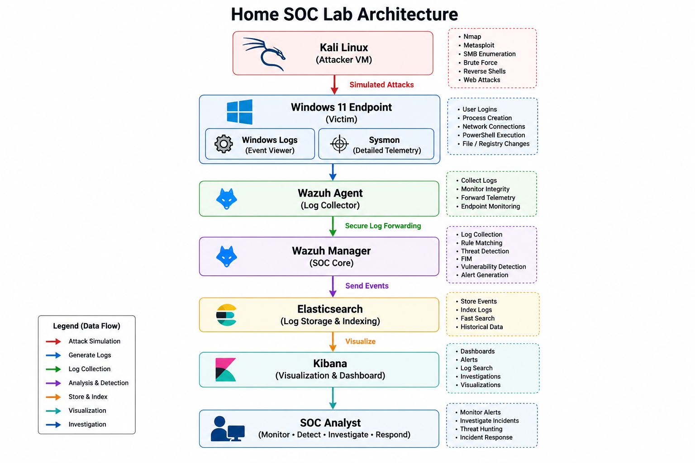

# 🛡️ Home SOC Lab

## 📌 Overview

This repository documents the design and implementation of a complete Home Security Operations Center (SOC) Lab built using VMware Workstation Pro, Wazuh, Sysmon, Windows 10, Ubuntu Server, and Kali Linux.

The lab simulates real-world attack scenarios, collects endpoint telemetry, detects malicious activity, performs threat hunting, maps detections to the MITRE ATT&CK framework, and documents investigations following SOC analyst workflows.

---

## 🏗️ Lab Architecture




---


## 🎯 Objectives

- Build a fully functional Home SOC Lab
- Deploy and configure Wazuh SIEM
- Collect Windows endpoint telemetry using Sysmon
- Simulate attacks from Kali Linux
- Validate built-in and custom Wazuh detections
- Perform threat hunting and alert investigation
- Map detections to the MITRE ATT&CK framework
- Document investigations and detection engineering
- Build an interview-ready cybersecurity portfolio
- Create SOC-style incident reports
- Develop vendor-neutral Sigma detection rules
- Document threat hunting workflows

---

## 🛠️ Technologies

| Category | Technology |
|----------|------------|
| Hypervisor | VMware Workstation Pro |
| SIEM | Wazuh |
| Endpoint Monitoring | Sysmon |
| Operating Systems | Ubuntu Server, Windows 10, Kali Linux |
| Detection Engineering | Wazuh Rules, Sysmon |
| Detection Format | Sigma Rules |
| Framework | MITRE ATT&CK |
| Version Control | Git & GitHub |
| Endpoint Agent | Wazuh Agent |
| Attacker VM | Kali Linux |

---

## 🔍 Detection Coverage

The following attack techniques and behaviors were implemented and successfully validated within the Home SOC Lab:


- PowerShell Execution
- Windows Discovery Commands
  - whoami
  - hostname
  - ipconfig
  - net user
- Certutil Encode/Decode Activity
- PowerShell EncodedCommand
- Suspicious PowerShell Flags
- Custom Notepad Detection
- Custom MSHTA Detection
- Custom Regsvr32 Detection


---

## ⭐ Repository Highlights

- Enterprise-inspired Home SOC Lab
- End-to-end detection engineering workflow
- Wazuh SIEM deployment
- Sysmon endpoint telemetry
- MITRE ATT&CK mapping
- Sigma rule development
- Incident investigation documentation
- Threat hunting demonstrations
- Custom Wazuh detection rules
- Interview-ready project documentation

---

## 📂 Repository Structure

```text
architecture/
attack-simulations/
dashboards/
detection-rules/
docs/
incident-reports/
installation/
mitre-attack/
resources/
screenshots/
scripts/
sigma-rules/
.gitignore
LICENSE
README.md
```

---

## 🚧 Project Status

| Component | Status |
|----------|--------|
| Infrastructure | ✅ Complete |
| Detection Engineering | ✅ Complete |
| Attack Simulations | ✅ Complete |
| Detection Documentation | ✅ Complete |
| Incident Reports | ✅ Complete |
| MITRE ATT&CK Mapping | ✅ Complete |
| Sigma Rules | ✅ Complete |
| Scripts | ✅ Complete |
| Dashboards | ✅ Complete |
| Final Repository Polish | ✅ Complete |
| Overall Project | ✅ Complete |

---

## 📖 Learning Outcomes

Through this project I gained hands-on experience with:

- SIEM deployment and administration
- Windows endpoint monitoring
- Sysmon log analysis
- Threat hunting and alert investigation
- Detection engineering
- Custom Wazuh rule development
- MITRE ATT&CK mapping
- SOC investigation workflow
- Security documentation and incident reporting
- Sigma rule development
- ATT&CK-based detection analysis
- SOC alert triage workflow

---

## 🔄 Detection Workflow

The Home SOC Lab follows a complete detection lifecycle:

1. Generate controlled security activity
2. Collect endpoint telemetry through Sysmon
3. Forward logs using Wazuh Agent
4. Trigger and analyze detections
5. Investigate events through Wazuh Dashboard
6. Map activity to MITRE ATT&CK
7. Document findings through incident reports and Sigma rules

---

## 📜 License

This project is licensed under the MIT License. See the LICENSE file for more information.

---

## 📬 Contact

- LinkedIn: https://www.linkedin.com/in/vinay-kundu-01602332a/
- Email: vinaykundu3007@gmail.com
- Github: https://github.com/x-mennn
