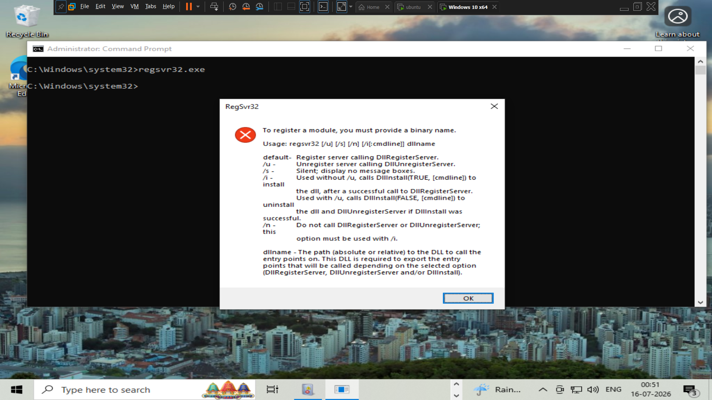

# Regsvr32 Simulation

## Objective

This simulation was performed to validate a custom Wazuh detection rule for `regsvr32.exe` execution. The generated telemetry was used to verify Sysmon event collection and successful triggering of the custom detection rule.

---

## Technique Overview

Regsvr32 (`regsvr32.exe`) is a legitimate Microsoft-signed binary used to register and unregister DLL files. Because it is a trusted Windows binary, attackers may abuse it as a Living Off the Land Binary (LOLBin) to execute malicious code while attempting to evade security controls.

---

## MITRE ATT&CK

| Technique | ID |
|-----------|----|
| Signed Binary Proxy Execution: Regsvr32 | T1218.010 |

---

## Commands Executed

```cmd
regsvr32.exe
```

> The command was executed on the Windows 10 endpoint to simulate Regsvr32 execution and generate telemetry for custom rule validation.

---

## Attack Execution



---


## Expected Detection

The simulation was expected to generate:

- Sysmon Process Creation (Event ID 1)
- Wazuh alert generated by the custom Regsvr32 detection rule
- Process information including the executable name, command line, parent process, and user context

---

## Outcome

The simulation successfully generated the expected Sysmon event and triggered the custom Wazuh detection rule, confirming that Regsvr32 execution was being monitored correctly within the Home SOC Lab.

---

## Related Documentation

- `../docs/regsvr32-detection.md`
- `../detection-rules/`
- `../incident-reports/`
- `../mitre-attack/`
- `../sigma-rules/`