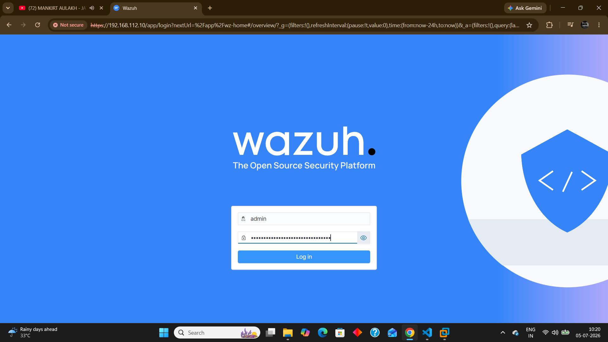
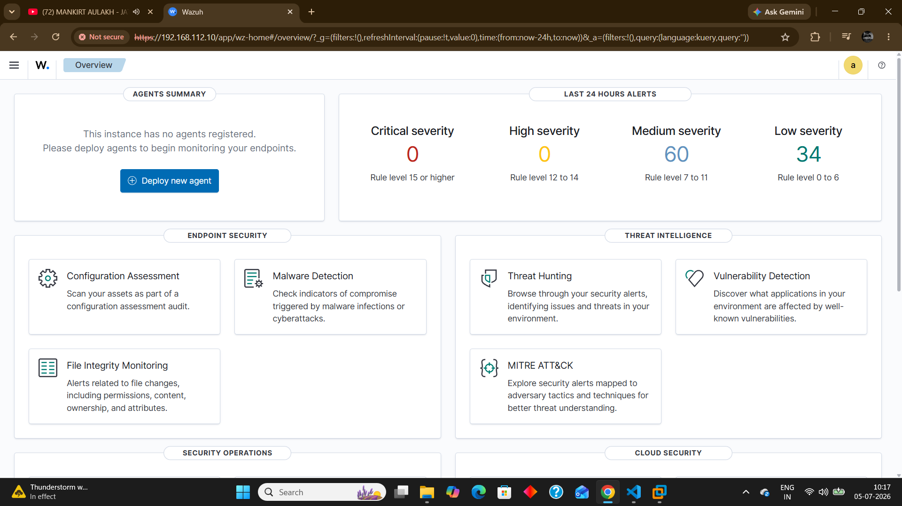
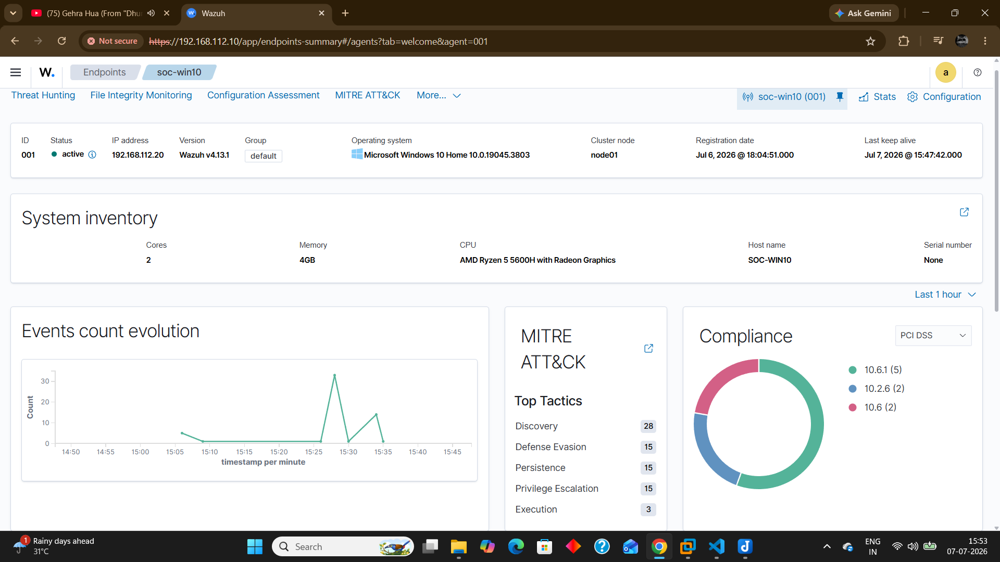

# Wazuh Dashboard Overview

## Overview

The Wazuh Dashboard provides a centralized interface for monitoring security alerts, analyzing endpoint activity, and investigating detected events.

In the Home SOC Lab, the dashboard was used to validate detections generated from Sysmon telemetry collected on the Windows endpoint.

---

## Dashboard Usage

The Wazuh Dashboard was used for:

- Reviewing triggered alerts
- Analyzing detection rule information
- Inspecting event fields
- Investigating endpoint activity
- Validating detection results

---

## Dashboard Overview

---

