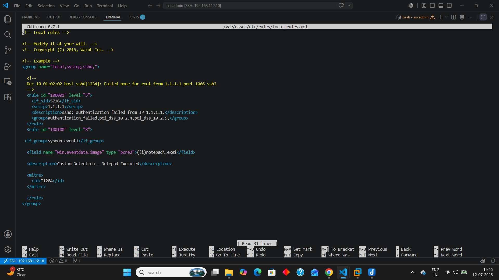

# Detection Rules

## Overview

This directory documents all Wazuh detection rules implemented and validated in the Home SOC Lab.

Each rule includes:

- Rule ID
- Rule Type
- Detection Summary
- Trigger Logic
- MITRE ATT&CK Mapping
- Investigation Guidance
- Expected False Positives
- Detection Importance

The purpose of this directory is to explain how each detection works and how a SOC analyst should investigate the generated alerts.

---

## Built-in Wazuh Rules

| Rule ID | Detection |
|----------|-----------|
| 92205 | PowerShell Execution |
| 92004 | whoami Execution |
| 92031 | hostname Execution |
| 92032 | ipconfig Execution |
| 92036 | net user Execution |
| 92073 | Certutil Encode/Decode |
| 92057 | PowerShell EncodedCommand |
| 92027 | PowerShell Suspicious Flags |

---

## Custom Wazuh Rules

| Rule ID | Detection |
|----------|-----------|
| 100100 | Notepad Execution |
| 100102 | MSHTA Execution |
| 100103 | Regsvr32 Execution |

---

---

## Purpose

These documents demonstrate an understanding of Wazuh detection logic, Windows telemetry, Sysmon process creation events, and MITRE ATT&CK mapping. Each rule has been validated within the Home SOC Lab using controlled attack simulations.