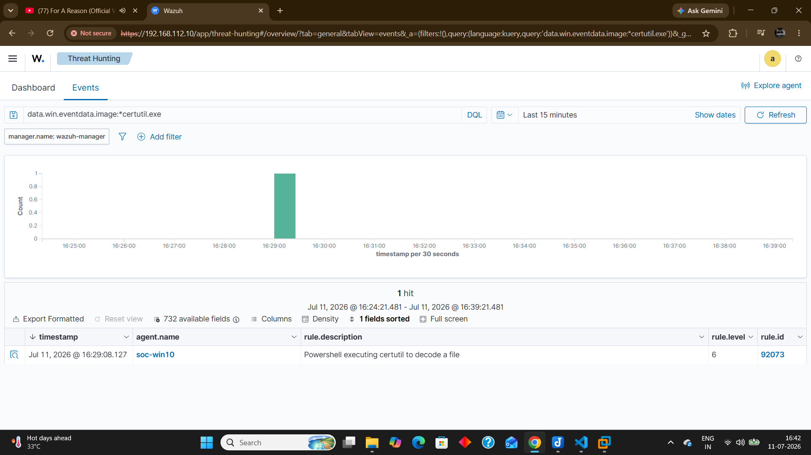
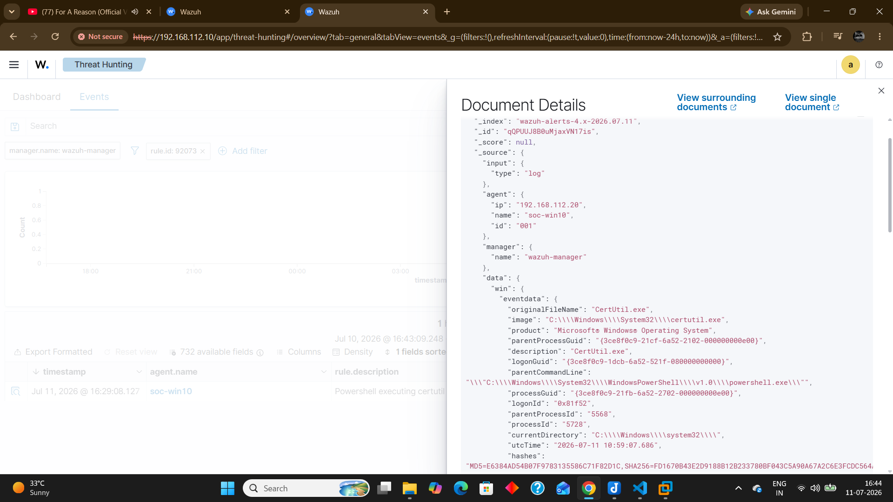
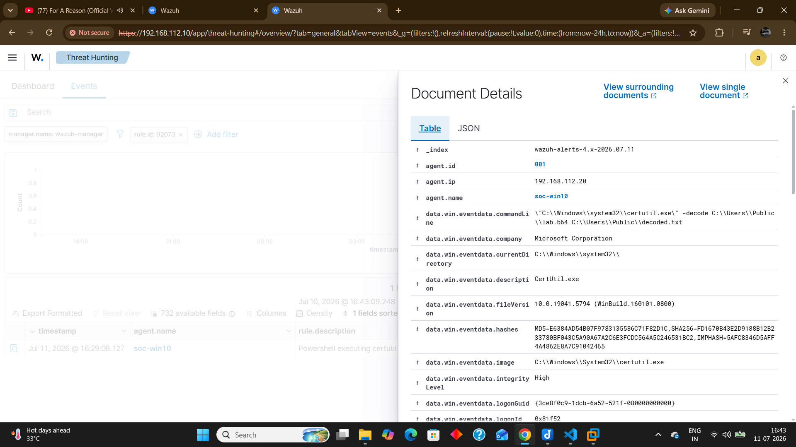

# Sprint 14 - Certutil Detection

## Objective

Validate Wazuh detections generated by the execution of the native Windows LOLBin `certutil.exe` and investigate the associated Sysmon Process Create event.

---

## Lab Scenario

The following commands were executed from an elevated PowerShell session.

```powershell
echo Home-SOC-Lab > C:\Users\Public\lab.txt
certutil -encode C:\Users\Public\lab.txt C:\Users\Public\lab.b64
certutil -decode C:\Users\Public\lab.b64 C:\Users\Public\decoded.txt
type C:\Users\Public\decoded.txt
```

The activity simulates a common attacker technique where Certutil is abused to encode or decode files while using a trusted Windows LOLBin.

---
## Detection Evidence







---

## Detection Results

The following Wazuh rule was triggered.

Rule ID

92073

Description

PowerShell executing certutil to decode a file

Rule Level

6

---

## Sysmon Investigation

Event Source

Sysmon Event ID 1

Observed Process

certutil.exe

Parent Process

powershell.exe

Executed User

SOC-WIN10\kundu

Endpoint

soc-win10

Verified that Sysmon successfully recorded the Process Create event before Wazuh generated the detection.

---

## Detection Rule Analysis

Rule ID

92073

Parent Rule

92072

Detection Logic

The detection rule monitors Sysmon Process Create (Event ID 1) events and identifies when PowerShell launches `certutil.exe` with decode-related command-line arguments.

Rule Source

/var/ossec/ruleset/rules/0800-sysmon_id_1.xml

---

## MITRE ATT&CK

Tactic

Defense Evasion

Technique

T1140

Technique Name

Deobfuscate/Decode Files or Information

---

## Investigation Summary

The execution of `certutil.exe` generated a Sysmon Process Create (Event ID 1) event.

The event was collected by the Wazuh Agent and forwarded to the Wazuh Manager, where Rule **92073** detected PowerShell executing Certutil with decoding functionality.

The investigation confirmed the complete detection workflow from endpoint telemetry to Wazuh alert generation, including the parent-child relationship between PowerShell and Certutil.

---

## SOC Analyst Assessment

Severity

Medium (Rule Level 6)

Classification

True Positive

Reason

The alert accurately detected the execution of the native Windows LOLBin `certutil.exe`.

Although Certutil is a legitimate Microsoft utility, it is frequently abused by attackers to decode payloads and evade traditional detections.

In this lab, the activity was intentionally generated by the authorized administrator to validate detection engineering and SOC monitoring capabilities.

---

## Learning Outcomes

✔ Simulated LOLBin activity using Certutil

✔ Verified Sysmon Event ID 1 logging

✔ Investigated Wazuh Rule 92073

✔ Analyzed complete JSON event

✔ Reviewed the underlying Wazuh detection rule

✔ Mapped the detection to MITRE ATT&CK T1140

✔ Performed SOC-style alert investigation

✔ Classified the detection as a True Positive