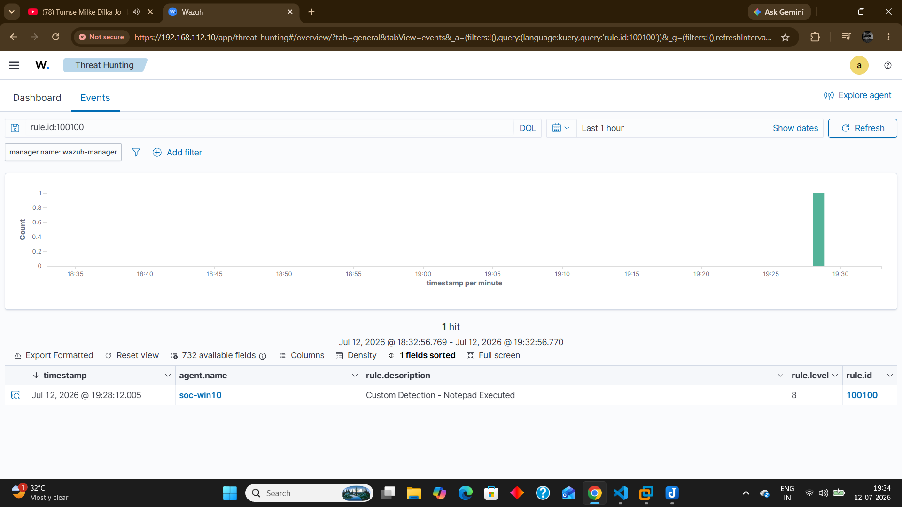
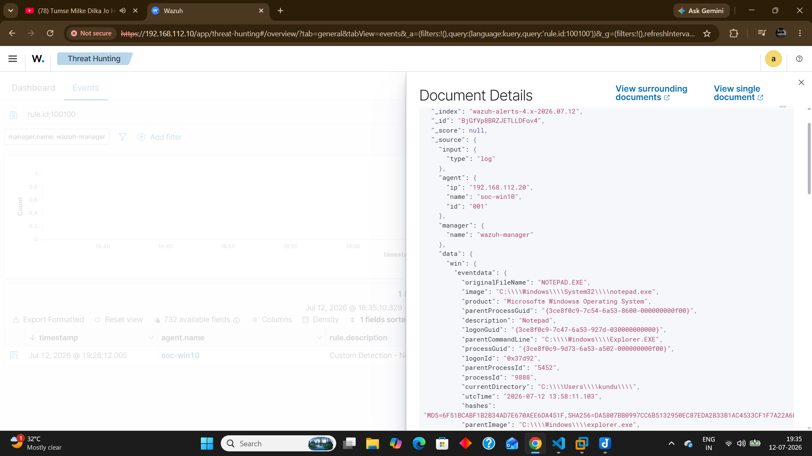
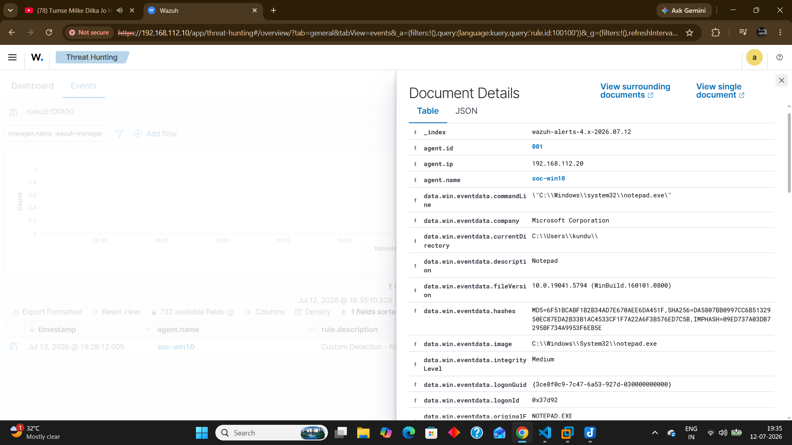

# Sprint 15 - Custom Wazuh Detection Rule

## Objective

Create and validate the first custom Wazuh detection rule using local_rules.xml to detect execution of notepad.exe.

---

## Detection Evidence









---

## Attack Simulation

Executed:

```cmd
notepad.exe

