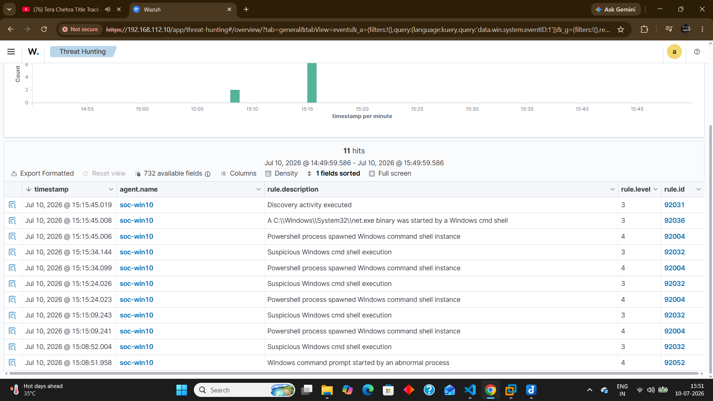
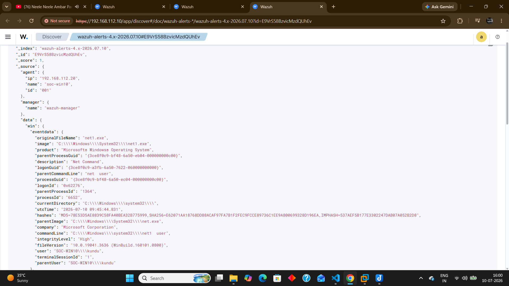
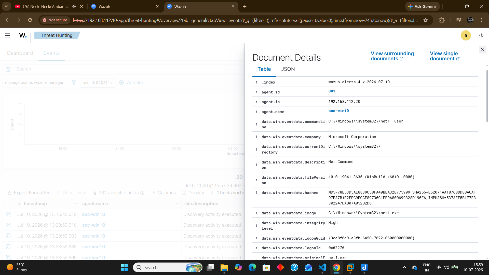

# Sprint 13 - Discovery Activity Detection

## Objective

Validate Wazuh detections generated from common Windows discovery commands executed through PowerShell and Command Prompt.

---

## Lab Scenario

The following commands were executed from an elevated PowerShell session.

cmd.exe /c whoami

cmd.exe /c hostname

cmd.exe /c ipconfig

cmd.exe /c net user

These commands simulate the discovery phase commonly observed after an attacker gains initial access.

---

## Detection Results

The following Wazuh rules were triggered.

Rule 92004
PowerShell process spawned Windows command shell instance.

Rule 92032
Suspicious Windows cmd shell execution.

Rule 92036
A Windows net.exe binary was started by a Windows cmd shell.

Rule 92031
Discovery activity executed.

---

## Detection Evidence

---

## Sysmon Investigation

Event Source

Sysmon Event ID 1

Observed Process

net1.exe

Parent Process

net.exe

Executed User

SOC-WIN10\kundu

Endpoint

soc-win10

Integrity Level

High

---

## MITRE ATT&CK

Tactic

Discovery

Technique

T1087

Technique Name

Account Discovery

---

## Investigation Summary

The executed commands generated multiple Sysmon Process Create events which were successfully ingested by Wazuh.

Wazuh correlated the activity into several detections, including PowerShell spawning Command Prompt, execution of net.exe, and Account Discovery.

The JSON event confirmed that Windows internally executed net1.exe after the net user command.

---

## SOC Analyst Assessment

Severity

Low (Rule Level 3)

Classification

True Positive

Reason

The detection accurately identified discovery commands executed during the lab exercise.

The activity was intentionally generated by the authorized administrator account and therefore represents benign administrative behavior rather than malicious activity.

---

## Learning Outcomes

✔ Investigated Sysmon Event ID 1

✔ Performed Threat Hunting in Wazuh

✔ Analyzed Rule 92031

✔ Inspected complete JSON event

✔ Mapped the alert to MITRE ATT&CK T1087

✔ Performed SOC-style investigation

✔ Distinguished between True Positive and malicious activity