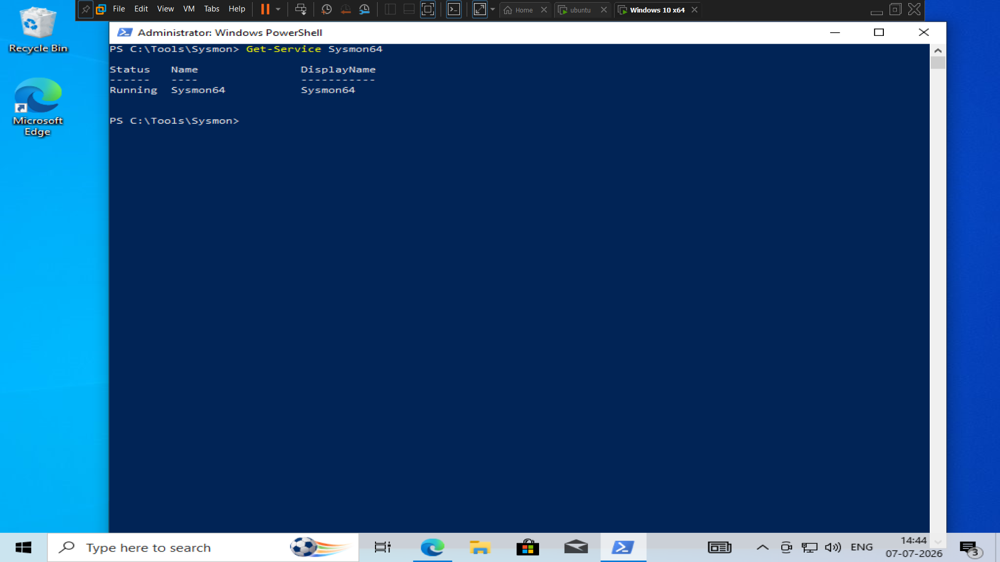
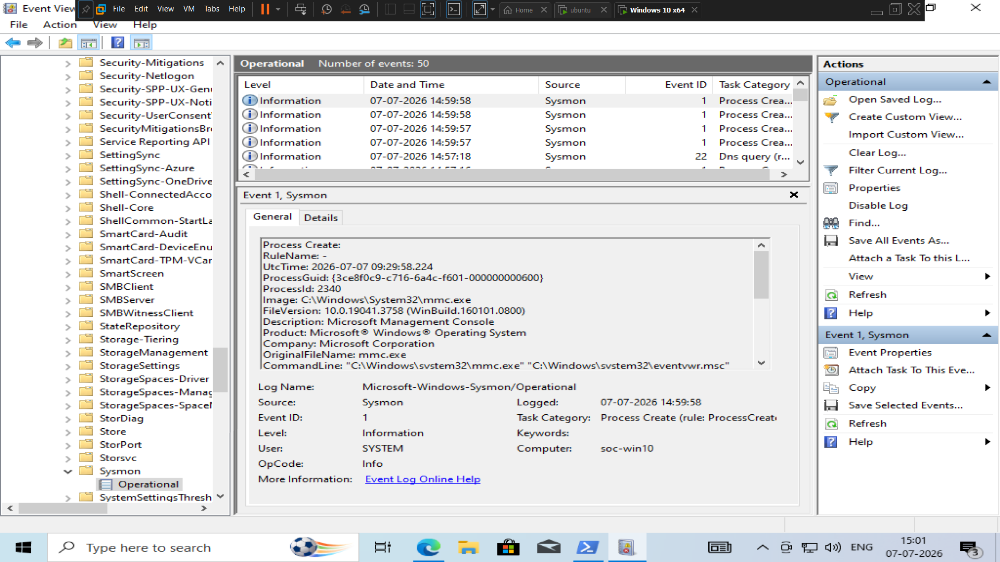

# Sysmon Deployment and Wazuh Integration

**Sprint:** 10  
**Status:** Completed

## Objective

Enhance Windows endpoint telemetry by deploying Microsoft Sysmon with the SwiftOnSecurity configuration and integrating Sysmon logs into Wazuh for advanced threat detection and threat hunting.

---

## Environment

| Component | Details |
|----------|---------|
| Operating System | Windows 10 Pro |
| Hostname | soc-win10 |
| IP Address | 192.168.112.20 |
| SIEM Platform | Wazuh |
| Sysmon Version | Latest Sysinternals Release |
| Configuration | SwiftOnSecurity Sysmon Configuration |

---

## Installation Steps

### 1. Download Sysmon

Downloaded the official Sysmon package from Microsoft Sysinternals.

### 2. Download Sysmon Configuration

Downloaded the SwiftOnSecurity Sysmon configuration file.

### 3. Install Sysmon

Installed Sysmon using the following command:

```powershell
Sysmon64.exe -accepteula -i sysmonconfig-export.xml
```

---

## Verification

Verified the Sysmon service:

```powershell
Get-Service Sysmon64
```

Status:

```
Running
```

Verified Sysmon events in:

```
Event Viewer
Applications and Services Logs
Microsoft
Windows
Sysmon
Operational
```

---





---

## Wazuh Integration

Configured the Wazuh Agent to collect Sysmon Operational logs by adding the following configuration to `ossec.conf`:

```xml
<localfile>
  <location>Microsoft-Windows-Sysmon/Operational</location>
  <log_format>eventchannel</log_format>
</localfile>
```

Restarted the Wazuh Agent:

```powershell
Restart-Service WazuhSvc
```

---

## Test Events Generated

The following activities were performed to validate telemetry collection:

- Opened Notepad
- Opened Command Prompt
- Executed PowerShell
- Created a test file
- Generated network traffic using `ping`

---

## Validation

Confirmed that:

- Sysmon service is running.
- Sysmon events are generated successfully.
- Windows Event Viewer records Sysmon Operational events.
- Wazuh Agent collects Sysmon logs.
- Sysmon events are searchable in Wazuh Threat Hunting.

---

## Screenshots

### Windows

- `sysmon-service-running.png`
- `sysmon-operational-events.png`
- `sysmon-process-creation-event.png`

### Threat Hunting

- `threat-hunting-agent-dashboard.png`
- `threat-hunting-agent-events.png`
- `wazuh-endpoint-dashboard.png`

---

## Outcome

The Windows endpoint now provides detailed endpoint telemetry through Sysmon, enabling improved detection engineering, threat hunting, incident investigation, and MITRE ATT&CK mapping within the Home SOC Lab.