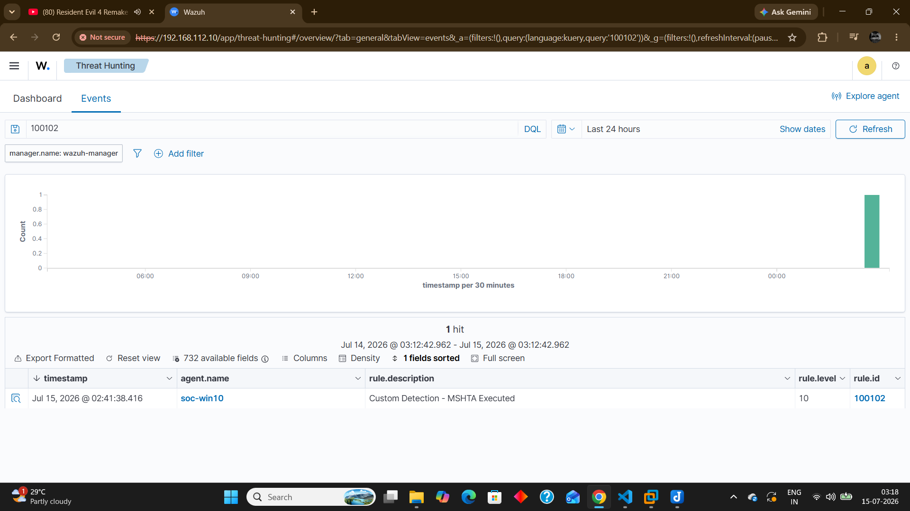
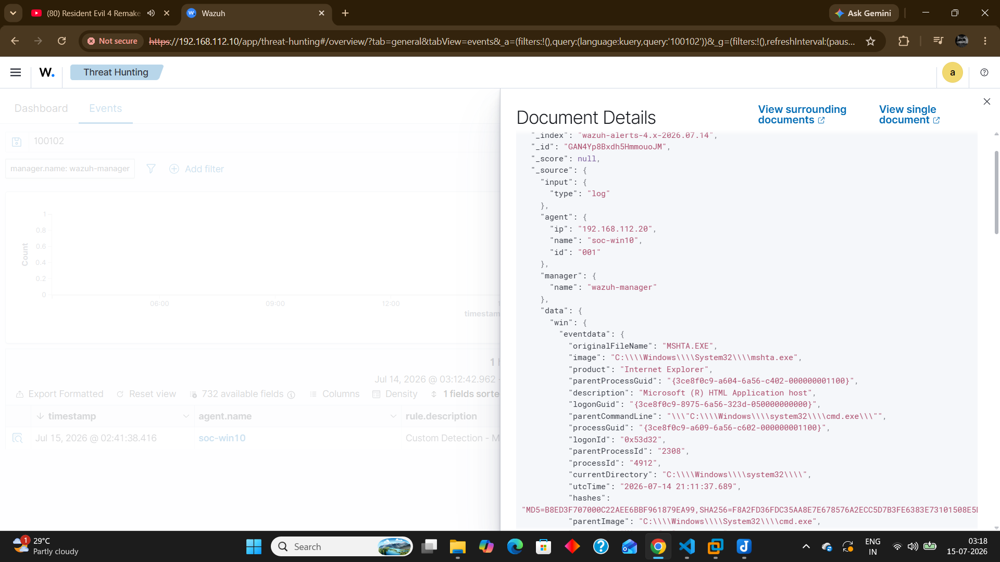
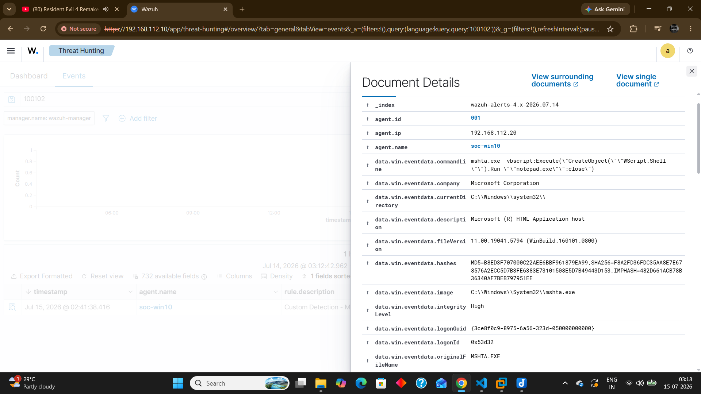

# Incident Report - MSHTA Execution Activity

## Incident Summary

| Field | Value |
|--------|-------|
| Incident ID | INC-004 |
| Detection | Suspicious MSHTA Execution |
| Severity | Medium |
| Status | Closed |
| Detection Source | Wazuh + Sysmon |
| Endpoint | soc-win10 |

---

## Description

A suspicious MSHTA execution was detected on the monitored Windows endpoint during a controlled security validation exercise.

The execution generated a Sysmon Process Creation event, which was collected by the Wazuh Agent and analyzed by the Wazuh Manager.

The investigation focused on determining whether mshta.exe was being used for legitimate HTML Application execution or potential script-based abuse.

---

## Detection Details

| Field | Value |
|--------|-------|
| Wazuh Rule ID | 100102 |
| Sysmon Event ID | 1 |
| Log Source | Windows Sysmon |
| Process | mshta.exe |
| Rule Type | Custom Detection Rule |

---

## MITRE ATT&CK

| Technique | Name |
|-----------|------|
| T1218.005 | System Binary Proxy Execution: Mshta |

---

## Investigation

---

### Initial Alert

Wazuh generated an alert after detecting execution of mshta.exe on the monitored endpoint.

The alert was correlated with Sysmon process creation telemetry to analyze the execution context and identify potential misuse.

---

### Investigation Process

The analyst reviewed:

- Process name
- Command-line arguments
- Parent-child process relationship
- User account context
- Execution timestamp
- Process execution path

The investigation focused on identifying whether mshta.exe execution was associated with normal application behavior or suspicious script execution.

---

### Evidence Collected

- Process Name: mshta.exe
- Data Source: Sysmon Event ID 1
- Detection Rule: 100102
- Command-line information
- Wazuh alert JSON data
- Endpoint: soc-win10

---

## Analysis

MSHTA is a legitimate Windows utility used to execute HTML Applications.

Attackers may abuse mshta.exe to bypass traditional security controls and execute malicious scripts while appearing as a trusted Windows process.

The activity was intentionally generated within the Home SOC Lab to validate custom detection capabilities.

No persistence, unauthorized access, or additional malicious behavior was identified.

---

## Impact Assessment

No security impact was identified.

The activity was performed in an isolated Home SOC Lab environment for detection engineering validation.

---

## Response

The following actions were performed:

- Reviewed Wazuh alert details
- Verified Sysmon process creation event
- Analyzed mshta execution context
- Confirmed custom detection rule triggered successfully
- Documented investigation findings

---

## Lessons Learned

Monitoring trusted Windows utilities is essential because attackers frequently abuse legitimate binaries to execute malicious activity.

Custom detections for LOLBins improve visibility and help SOC analysts identify suspicious execution behavior.