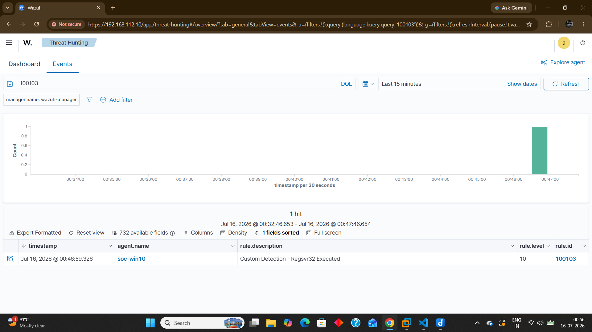
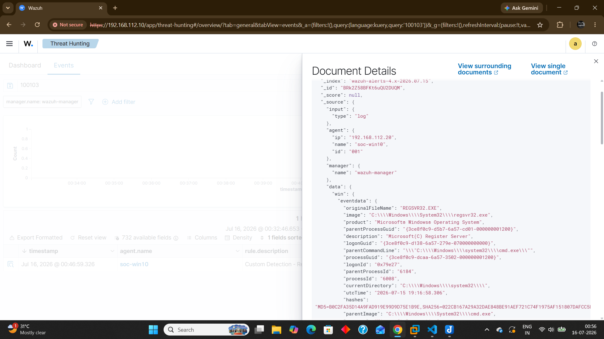
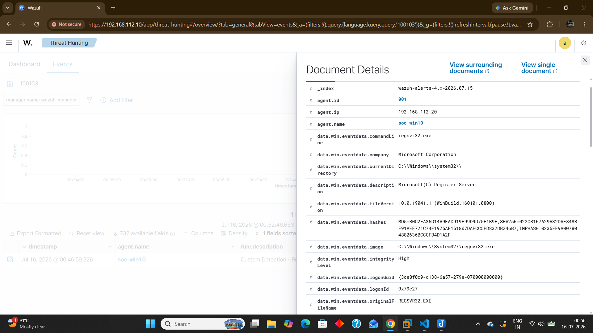

# Incident Report - Regsvr32 Execution Activity

## Incident Summary

| Field | Value |
|--------|-------|
| Incident ID | INC-005 |
| Detection | Suspicious Regsvr32 Execution |
| Severity | Medium |
| Status | Closed |
| Detection Source | Wazuh + Sysmon |
| Endpoint | soc-win10 |

---

## Description

A suspicious regsvr32 execution was detected on the monitored Windows endpoint during a controlled security validation exercise.

The execution generated a Sysmon Process Creation event, which was collected by the Wazuh Agent and analyzed by the Wazuh Manager.

The investigation focused on determining whether regsvr32.exe was being used for legitimate DLL registration activity or potential abuse of a trusted Windows binary.

---

## Detection Details

| Field | Value |
|--------|-------|
| Wazuh Rule ID | 100103 |
| Sysmon Event ID | 1 |
| Log Source | Windows Sysmon |
| Process | regsvr32.exe |
| Rule Type | Custom Detection Rule |

---

## MITRE ATT&CK

| Technique | Name |
|-----------|------|
| T1218.010 | System Binary Proxy Execution: Regsvr32 |

---

## Investigation

---

### Initial Alert

Wazuh generated an alert after detecting regsvr32.exe execution on the monitored endpoint.

The alert was reviewed with related Sysmon process creation telemetry to understand the execution context and determine potential misuse.

---

### Investigation Process

The analyst reviewed:

- Process name
- Command-line arguments
- Parent-child process relationship
- User account context
- Execution timestamp
- Process execution path

The investigation was performed to determine whether the activity represented normal administrative behavior or suspicious execution using a trusted Windows binary.

---

### Evidence Collected

- Process Name: regsvr32.exe
- Data Source: Sysmon Event ID 1
- Detection Rule: 100103
- Command-line execution details
- Wazuh JSON alert data
- Endpoint: soc-win10

---

## Analysis

Regsvr32 is a legitimate Windows utility used for registering Dynamic Link Libraries (DLLs).

Attackers may abuse regsvr32 as a Living-off-the-Land Binary (LOLBIN) to execute malicious code while leveraging a trusted Windows process.

The activity was intentionally generated within the Home SOC Lab to validate custom detection logic.

No unauthorized execution, persistence mechanisms, or additional malicious behavior was identified during investigation.

---

## Impact Assessment

No security impact was identified.

The activity was performed inside the isolated Home SOC Lab environment for detection validation and monitoring improvement.

---

## Response

The following actions were performed:

- Reviewed the Wazuh alert
- Verified Sysmon Event ID 1 telemetry
- Analyzed regsvr32 execution details
- Confirmed custom detection rule functionality
- Documented investigation findings

---

## Lessons Learned

Attackers frequently abuse legitimate Windows utilities to avoid detection and blend into normal system activity.

Monitoring LOLBins such as regsvr32 improves endpoint visibility and helps SOC analysts identify suspicious execution techniques.