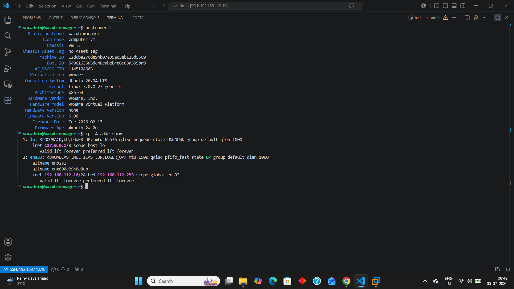
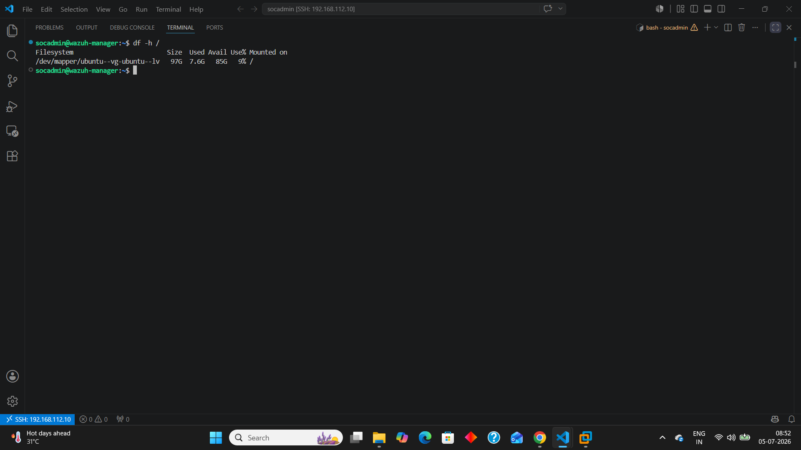
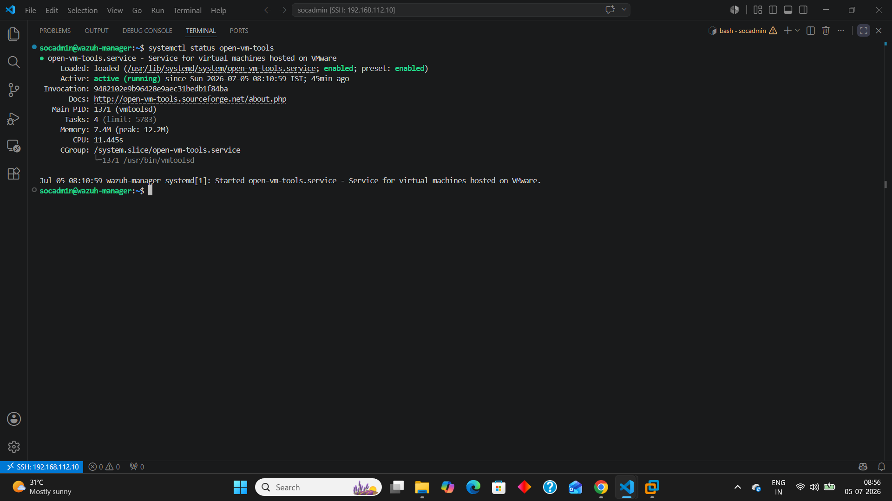
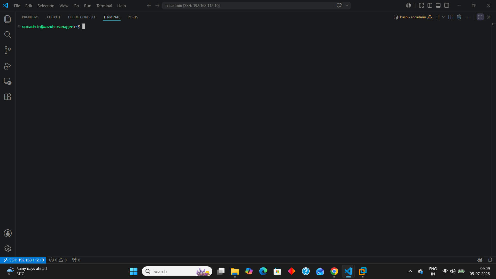

# Installation Guide

## Overview

This section documents the complete installation and configuration process for the Home SOC Lab environment. The objective is to build an enterprise-inspired Security Operations Center (SOC) lab using industry-standard tools, secure configurations, and reproducible deployment procedures.

Every installation phase is validated before moving to the next component to ensure the environment remains stable, reliable, and easy to troubleshoot.

---

# Installation Roadmap

The Home SOC Lab is being deployed in the following order:

1. Hypervisor Installation ✅
2. Virtual Network Configuration ✅
3. Ubuntu Server Deployment ✅
4. Windows Endpoint Deployment ✅
5. Wazuh Platform Installation ✅
6. Sysmon Deployment ✅
7. Wazuh Agent Enrollment ✅
8. Dashboard Configuration ✅
9. Detection Engineering ✅
10. Attack Simulation ✅
11. Detection Validation ✅
12. Incident Reporting ✅

---

# Installation Philosophy

Every component in this project follows these principles:

- Official installation sources
- Step-by-step documentation
- Verification after installation
- Reproducible configuration
- Enterprise best practices

---

# Current Status

| Component | Status |
|-----------|--------|
| VMware Workstation Pro | ✅ Completed |
| Virtual Networking | ✅ Completed |
| Ubuntu Server | ✅ Completed |
| Windows 10 Endpoint | ✅ Completed |
| Wazuh Platform | ✅ Completed |
| Sysmon Deployment | ✅ Completed |
| Wazuh Agent Enrollment | ✅ Completed |
| Dashboard Configuration | ✅ Completed |
| Detection Engineering | ✅ Completed |
| Attack Simulations | ✅ Completed |
| Incident Reporting | ✅ Completed |

---

# VMware Workstation Pro Installation

VMware Workstation Pro was selected as the virtualization platform because it provides enterprise-grade virtualization, reliable networking, snapshot support, and excellent compatibility with cybersecurity labs.

## Installation Verification

### VMware Workstation Installed

---

### Virtual Network Editor

---

### VMware Preferences

---

# Ubuntu Server Deployment

Ubuntu Server 26.04 LTS was deployed as the primary Wazuh Manager server for the Home SOC Lab.

The server is administered remotely using Visual Studio Code Remote SSH, following enterprise administration practices.

---

## Server Configuration

| Setting | Value |
|----------|-------|
| Operating System | Ubuntu Server 26.04 LTS |
| Hostname | wazuh-manager |
| Username | socadmin |
| vCPU | 4 |
| Memory | 8 GB |
| Disk | 100 GB (Thin Provision) |
| Firmware | UEFI |
| Network | NAT |
| Static IP | 192.168.112.10/24 |

---

## Configuration Tasks Completed

- Ubuntu Server installation
- System update
- System upgrade
- Static IP configuration
- OpenSSH installation
- VS Code Remote SSH configuration
- Root filesystem expansion
- Open VM Tools verification

---

## Installation Verification

### System Identity & Network

Hostname and static IP configuration were verified after deployment.

---

### Disk Verification

The root filesystem was successfully expanded to utilize the complete virtual disk.

---

### Open VM Tools

VMware guest integration services were verified successfully.

---

### Remote Administration

Ubuntu Server is managed remotely through Visual Studio Code using the Remote SSH extension.

---

# Result

The complete Home SOC Lab was successfully deployed and validated.

The installation phase included:

- VMware Workstation Pro setup
- Virtual network configuration
- Ubuntu Server deployment
- Windows 10 endpoint deployment
- Kali Linux deployment
- Wazuh platform installation
- Wazuh Agent enrollment
- Sysmon deployment
- Remote administration setup
- Detection validation

The environment is fully operational and serves as the foundation for detection engineering, threat hunting, and incident investigation documented throughout this repository.

The completed installation provides the infrastructure required for endpoint monitoring, detection engineering, threat hunting, attack simulation, and incident response throughout the Home SOC Lab.
---

# Notes

All installation procedures documented in this directory were successfully completed and validated during the development of this Home SOC Lab.

The documentation reflects the final deployment used throughout the detection engineering, threat hunting, and incident response exercises included in this repository.