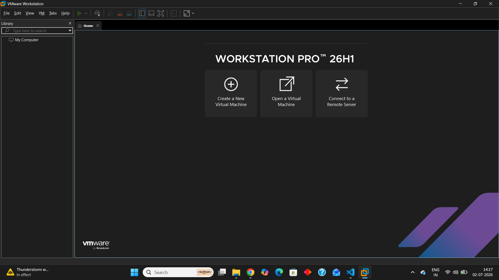
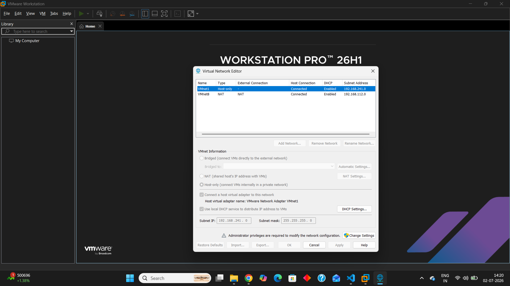
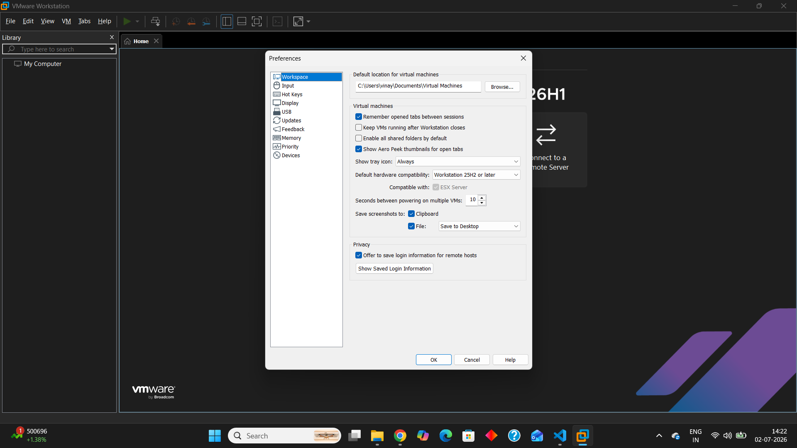

# Installation Guide

## Overview

This section documents the complete installation and configuration process for the Home SOC Lab environment. The goal is to build a stable, enterprise-inspired Security Operations Center (SOC) lab using industry-standard tools and best practices.

The installation process is intentionally divided into multiple phases to ensure every component is deployed, configured, and validated correctly before moving to the next stage.

---

## Installation Roadmap

The Home SOC Lab will be built in the following order:

1. Hypervisor Installation ✅
2. Virtual Network Configuration
3. Ubuntu Server Deployment
4. Windows Endpoint Deployment
5. Wazuh Server Installation
6. Elastic Stack & Kibana Configuration
7. Sysmon Deployment
8. Winlogbeat Configuration
9. Agent Enrollment
10. Log Collection Verification
11. Dashboard Configuration
12. Detection Rule Deployment
13. Attack Simulation
14. Detection Validation

---

## Hypervisor Selection

For this project, VMware Workstation Pro has been selected as the virtualization platform.

### Why VMware Workstation Pro?

- Enterprise-grade virtualization platform
- Excellent performance and stability
- Reliable virtual networking capabilities
- Snapshot support for safe testing
- Widely used in enterprise environments
- Well-suited for cybersecurity and SOC laboratories

---

## Installation Philosophy

Every component in this project will be:

- Installed from official sources whenever possible
- Documented step-by-step
- Tested before continuing
- Validated after installation
- Version documented for reproducibility

This approach follows industry best practices and ensures the environment remains stable, reproducible, and easy to troubleshoot.

---

## Current Status

| Component | Status |
|----------|--------|
| Hypervisor | ✅ Completed |
| Virtual Networking | ⏳ Pending |
| Ubuntu Server | ⏳ Pending |
| Windows Endpoint | ⏳ Pending |
| Wazuh Server | ⏳ Pending |
| Elastic Stack | ⏳ Pending |
| Kibana | ⏳ Pending |
| Sysmon | ⏳ Pending |
| Winlogbeat | ⏳ Pending |
| Agent Enrollment | ⏳ Pending |
| Log Verification | ⏳ Pending |
| Dashboard Configuration | ⏳ Pending |
| Detection Rules | ⏳ Pending |
| Attack Simulation | ⏳ Pending |

---

## VMware Workstation Pro Installation

VMware Workstation Pro was selected as the virtualization platform for this project because it provides enterprise-grade performance, stable virtual networking, snapshot support, and is widely used in professional enterprise environments.

The installation was completed successfully and verified before proceeding with virtual machine deployment.

---

## Installation Verification

### VMware Workstation Pro

The VMware Workstation Pro home interface confirms that the hypervisor has been installed successfully and is ready for virtual machine creation.

---

### Virtual Network Editor

The Virtual Network Editor confirms that VMware networking components were installed successfully. These virtual networks will be configured during the networking phase of the project.

---

### VMware Preferences

The VMware preferences panel was reviewed to verify the default workspace configuration before creating any virtual machines.

---

## Result

VMware Workstation Pro has been successfully installed and validated.

The Home SOC Lab environment is now ready for virtual machine deployment and network configuration.

---

## Notes

This document will be updated throughout the project as each installation phase is completed. Only verified and tested procedures will be documented to maintain accuracy, reproducibility, and enterprise-grade documentation standards.