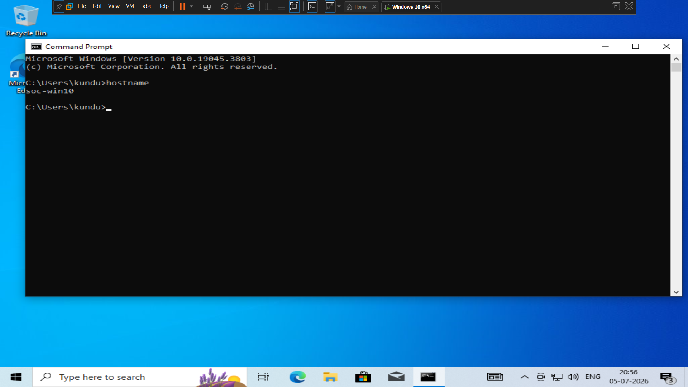
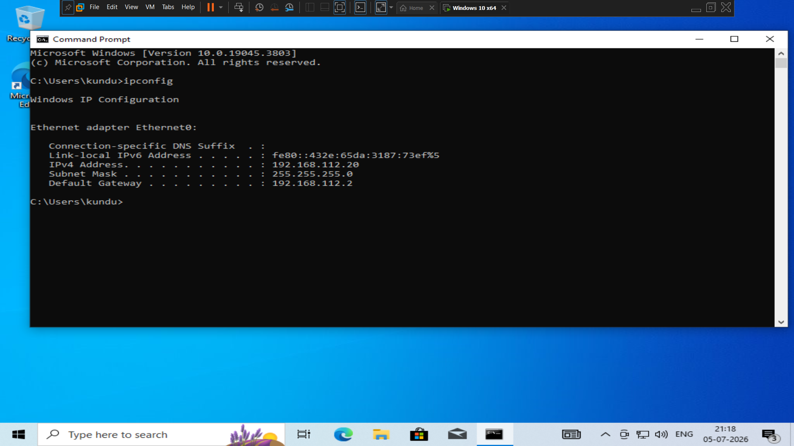
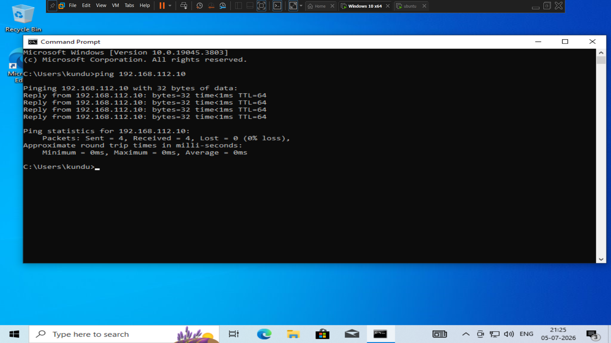

# 🪟 Windows 10 Installation

## Objective

Deploy a Windows 10 virtual machine to act as the monitored endpoint within the Home Security Operations Center (SOC) Lab.

The Windows endpoint is responsible for generating endpoint telemetry, executing attack simulations, and validating detection rules through the Wazuh Agent and Sysmon.

---

# Virtual Machine Configuration

| Setting | Value |
|----------|-------|
| Operating System | Windows 10 Pro |
| Hostname | soc-win10 |
| vCPU | 2 |
| Memory | 4 GB |
| Disk | 80 GB (Thin Provision) |
| Firmware | UEFI |
| Network | NAT |
| Static IP | 192.168.112.20/24 |

---

# Configuration Tasks

The following configuration tasks were completed after the operating system installation:

- Installed VMware Tools
- Configured a static IP address
- Renamed the hostname to **soc-win10**
- Verified network connectivity
- Installed the Wazuh Agent
- Installed Sysmon using the Sysmon Modular configuration

---

# Installation Verification

The following checks were performed after deployment:

- Windows endpoint booted successfully
- Static IP configuration verified
- Network communication confirmed
- Wazuh Agent successfully connected to the Wazuh Manager
- Sysmon service running successfully

---

### Windows Installation

### Hostname Verification

### Network Verification

### Connectivity Test

---

# Outcome

The Windows 10 endpoint was successfully deployed and integrated into the Home SOC Lab. It serves as the monitored system for telemetry collection, detection validation, and security monitoring.